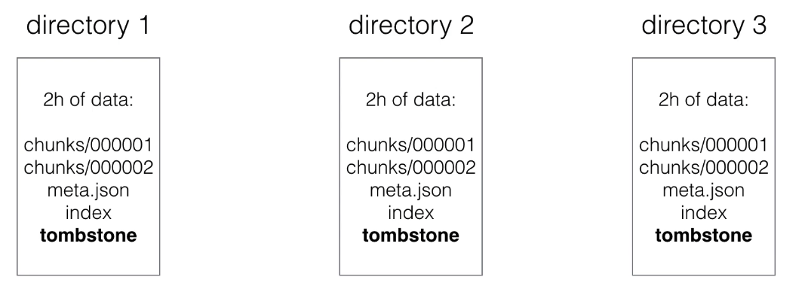

# Training Prometheus

# Table of contents
- [Training Prometheus](#training-prometheus)
- [Table of contents](#table-of-contents)
- [Introduction to Prometheus](#introduction-to-prometheus)
  - [Prometheus Overview](#prometheus-overview)
  - [How does Prometheus work?](#how-does-prometheus-work)
  - [Prometheus instalation on Kubernetes](#prometheus-instalation-on-kubernetes)
  - [Basic Concepts](#basic-concepts)
  - [Prometheus configuration](#prometheus-configuration)
  - [Monitoring Nodes with Prometheus](#monitoring-nodes-with-prometheus)
  - [Extras](#extras)
- [Monitoring](#monitoring)
  - [Client Libraries](#client-libraries)
  - [Pushing Metrics](#pushing-metrics)
  - [Querying](#querying)
  - [Service Discovery](#service-discovery)
    - [EC2 Example.](#ec2-example)
    - [Kubernetes examples](#kubernetes-examples)
    - [DNS Example](#dns-example)
    - [Using file](#using-file)
  - [Exporters](#exporters)
  - [Extras](#extras-1)
- [Alerting](#alerting)
  - [Introduction to Alerting](#introduction-to-alerting)
  - [Extras](#extras-2)
- [Internals](#internals)
  - [Prometheus Storage](#prometheus-storage)
  - [Prometheus Security](#prometheus-security)
- [Prometheus client implementations](#prometheus-client-implementations)
  - [Monitoring a web application - Python Flask](#monitoring-a-web-application---python-flask)
  - [Calculating Apdex score](#calculating-apdex-score)
  - [Monitoring a wb application - Java Spring](#monitoring-a-wb-application---java-spring)
  - [Extras](#extras-3)
- [Another Use Cases](#another-use-cases)
  - [AWS Cloudwatch Exporter](#aws-cloudwatch-exporter)
  - [Grafana Provisioning](#grafana-provisioning)
  - [Scraping Kubernetes with Prometheus](#scraping-kubernetes-with-prometheus)
  - [Consul integration with Prometheus](#consul-integration-with-prometheus)
  - [AWS EC2 Auto Discovery](#aws-ec2-auto-discovery)
  - [Extras](#extras-4)

# Introduction to Prometheus
## Prometheus Overview
* Prometheus is an Open source monitoring solution.
* Started at SoundCloud around 2012-2013, and was made public in early 2015.
* Prometheus provides Metrics & Alerting.
* It is inspired by Google's Borgmon, which uses time-series data as a datasource, to then send alerts bases on this data.
* It fits very well in the cloud native infrastructure.
* Prometheus is also a member of the CNCF (Cloud Native Fundation Computing).
* In Prometheus we talk about Dimensional Data: time series are idenfified by metric name and a set of key/value pairs.

| Metric name  | label  | Sample  |
|--------------|--------|---------|
| Temperature  | location=outside  | 90  |

* Prometheus includes a Flexible Query Language
* Visualizations can be shown using a built-in expression browser or with integrations like Grafana.
* It stores metrics in memory and local disk in an own custom, efficient format
* It si written in Go.
* Many client libraries and integrations available.


## How does Prometheus work?

* Prometheus collects metrics from monitored targets by scraping metrics HTTP endpoints.
  * This is fundamentally different than other monitoring and alerting systems, (except is also how Google's Borgmon works).
  * Rather than using custom scripts that check on particular services and systems, the monitoring data itself is used.
* Scraping endpoints is much more efficient than other mechanisms, like 3rd party agents.
  * a single Prometheus server is able to ingest up to one millon samples per seconds as several million time series.


## Prometheus instalation on Kubernetes
First step, create your enviroment:
```sh
# Initial your test environment
$ minikube start --network-plugin=cni --cni=calico -p prometheus

# Install kubeprometheus stack
$ helm install prometheus prometheus-community/kube-prometheus-stack
```


## Basic Concepts
* All data is stored as time series
  * Every time sries is identified by the __metric name__ and a set of __key-value pairs__, called __labels__.


| Metric name  | label  | Sample  |
|--------------|--------|---------|
| go_memstat_alloc_bytes  | {container="alertmanager", endpoint="web", instance="10.244.116.72:9093", job="prometheus-kube-prometheus-alertmanager", namespace="default", pod="alertmanager-prometheus-kube-prometheus-alertmanager-0", service="prometheus-kube-prometheus-alertmanager"}  | 8569840  |

* The time series data also consists of the actual data, called Samples:
  * It can be a float64 value
  * or a milisecond-precision timestamp
* The notation of time series is often using this notation:
  * `<metric name>{<label name>=<label value>, ...}`
  * For example:
    * `node_boot_time{instance="localhost:9100",job="node_exporter"}`


## Prometheus configuration
* The configuration is stored in the Prometheus configuration file, in yaml format.
* The default configuration looks like this:

```yaml
# my global config
global:
  scrape_interval: 15s # Set the scrape interval to every 15 seconds. Default is every 1 minute.
  evaluation_interval: 15s # Evaluate rules every 15 seconds. The default is every 1 minute.
  # scrape_timeout is set to the global default (10s).

# Alertmanager configuration
alerting:
  alertmanagers:
    - static_configs:
        - targets:
          # - alertmanager:9093

# Load rules once and periodically evaluate them according to the global 'evaluation_interval'.
rule_files:
  # - "first_rules.yml"
  # - "second_rules.yml"
```


## Monitoring Nodes with Prometheus
* To monitor nodes, you need to install the __node-exporter__.
* The node exporter will expose machine metrics of Linux machines.
  * For example: cpu usage, memory usage
* The node exporter can be used to monitor machines, and later on, you can __create alerts based on these ingested metrics__.
* For Windows, there's a WMI exporter.


* Posteriormente necesitará configurar prometheus para ir a por esas métricas:
```yaml
# my global config
global:
  scrape_interval: 15s # Set the scrape interval to every 15 seconds. Default is every 1 minute.
  evaluation_interval: 15s # Evaluate rules every 15 seconds. The default is every 1 minute.
  # scrape_timeout is set to the global default (10s).

....

# A scrape configuration containing exactly one endpoint to scrape:
# Here it's Prometheus itself.
scrape_configs:
  # The job name is added as a label `job=<job_name>` to any timeseries scraped from this config.
  - job_name: "prometheus"

    # metrics_path defaults to '/metrics'
    # scheme defaults to 'http'.

    static_configs:
      - targets: ["localhost:9090"]
```


## Extras
Links:
```sh
# Helm charts
https://github.com/prometheus-community/helm-charts

# Docs
https://prometheus.io/docs/introduction/overview/
```


# Monitoring
## Client Libraries
* Instrumenting your code
* Libraries
  * Official: Go, Java/Scala, Python, Ruby
  * Unofficial: bash, C++, Common Lisp, Elixr, Erlang, Haskell, Lua for Nginx, Lua for Tarantool, .NET/C#, Node.js, PHP, Rust
* No client library available?
  * Implement it yourself in one of the supported exposition formats

* Exposition formats:
  * Simple text-based format
  * Protocol-buffer format (Prometheus 2.0 removed support for the protocol-buffer format)
```
metric_name [
  "{" label_name "=" `"` label_value `"` { "," label_name "=" `"` label_value `"` } [ "," ] "}"
] value [ timestamp ]

# HELP http_requests_total The total number of HTTP requests.
# TYPE http_requests_total counter
http_requests_total{method="post",code="200"} 1027 1395066363000
http_requests_total{method="post",code="400"}    3 1395066363000

# Escaping in label values:
msdos_file_access_time_seconds{path="C:\\DIR\\FILE.TXT",error="Cannot find file:\n\"FILE.TXT\""} 1.458255915e9

# Minimalistic line:
metric_without_timestamp_and_labels 12.47

# A weird metric from before the epoch:
something_weird{problem="division by zero"} +Inf -3982045

# A histogram, which has a pretty complex representation in the text format:
# HELP http_request_duration_seconds A histogram of the request duration.
# TYPE http_request_duration_seconds histogram
http_request_duration_seconds_bucket{le="0.05"} 24054
http_request_duration_seconds_bucket{le="0.1"} 33444
http_request_duration_seconds_bucket{le="0.2"} 100392
http_request_duration_seconds_bucket{le="0.5"} 129389
http_request_duration_seconds_bucket{le="1"} 133988
http_request_duration_seconds_bucket{le="+Inf"} 144320
http_request_duration_seconds_sum 53423
http_request_duration_seconds_count 144320
```

* 4 types of metrics:
  * __Counter__. 
    * A value that only goes up (e.g Visits to a website).
  * __Gauge__. 
    * Single numeric value that an go up and down (e.g CPU load, temperature)
  * __Histogram__. 
    * Samples observations (e.g. requests durations or reponse sizes) and these observations get counted into __buckets__. Includes (_count and _sum). Main purpose is calculating quantiles.
  * __Summary__. 
    * Similar to a histogram, a summary samples observtiosn (e.g. request durations or response sizes). A summary also provides a total count of observations and a sum of all observed values, it calculates configurable quantiles over a sliding time window.
    * Example: you need 2 counters for calculating the latency
      * 1) Total request(_count)
      * 2) The total latency of those requets (_sum)
      * Take the rate() and divide = average latency.

* Client libraries examples https://prometheus.io/docs/instrumenting/clientlibs/
```py
from prometheus_client import start_http_server, Summary
import random
import time

# Create a metric to track time spent and requests made.
REQUEST_TIME = Summary('request_processing_seconds', 'Time spent processing request')

# Decorate function with metric.
@REQUEST_TIME.time()
def process_request(t):
    """A dummy function that takes some time."""
    time.sleep(t)

if __name__ == '__main__':
    # Start up the server to expose the metrics.
    start_http_server(8000)
    # Generate some requests.
    while True:
        process_request(random.random())
```

## Pushing Metrics
* Sometimes metrics cannot be scraped. Example: batch jobs, servers are not reachable due to NAT, firewall.
* Pushgateway is used as an intermediary service which allows you to push metrics. https://github.com/prometheus/pushgateway
.
* Pitfalls
  * Most of the times this is a single instance so this result is a SPOF.
  * Prometheus is automatic instance health monitoring is not possible.
  * The Pushgateway never forgets the metrics unless they are deletd via the api. Example: `curl -X DELETE http://localhost:9091/metrics/job/prom/instance/localhost`.


* Only 1 valid use case for the Pushgateway.
  * Service-lvel batch jobs and not related to a specific machine.
* If NAT or/both firewall is blocking you from using the pull mechanism.
  * Move the Prometheus Server on the same network.

* Example
```py
from prometheus_client import CollectorRegistry, Gauge, push_to_gateway, Summary, Histogram
from time import sleep
from random import randint, random

registry = CollectorRegistry()

cpu_util_sum_metric = Summary('cpu_util_summary', 'cpu_util_summary', registry=registry)
cpu_util_hist_metric = Summary('cpu_util_hist', 'cpu_util_hist', registry=registry)

for i in range(90):
  cpu_util = randint(0, 100)

  cpu_util_sum_metric.observe(float(cpu_util))
  cpu_util_hist_metric.observe(float(cpu_util))
  print('cpu util is: {}'.format(cpu_util))
  res = push_to_gateway('localhost:9091', job='cpu_stats', registry=registry)
  print('push_to_gateway result is:', str(res))
  sleep(5)
```

* __Pushgateway__ functions take a grouping key.
  * __push_to_gateway__ replaces metrics with the same grouping key.
  * __pushadd_to_gateway__ only replaces metrics with the same name and grouping key.
  * __delete_from_gateway__ delete metrics with the given job and grouping key.


## Querying
* Prometheus provides a functional expresions language called __PromQL__.
  * Provides built in operators and functions.
  * Vector-based calculations like Excel.
  * Expressions over time-series vectors.
* PromQL is __read-only__.
* Example:
  * `100 - (avg by (instance) (irate(node_cpu_seconds_total{job='node_exporter',mode="idle"}[5m])) * 100)`

* Instante vector - a set of time series containing a simple sample for each time series, all sharing the same timestamp. Example: `node_cpu_seconds_total`.
* Range vector - a set of time containing a range of data points over time for each time series. Example: `node_cpu_seconds_total[5m`.
* Scalar - a simple numeric floating point value. Example: `-3.14`.
* String - a simple string value; curretly unused. Example: `foobar`.


* [__Arithmetic binary operators__](https://prometheus.io/docs/prometheus/latest/querying/operators/#arithmetic-binary-operators).
* [__Trigonometric binary operators__](https://prometheus.io/docs/prometheus/latest/querying/operators/#trigonometric-binary-operators).
* [__Comparision binary operators__](https://prometheus.io/docs/prometheus/latest/querying/operators/#comparison-binary-operators).
* [__Logical/set binary operators__](https://prometheus.io/docs/prometheus/latest/querying/operators/#logical-set-binary-operators).
* [__Aggregation operators__](https://prometheus.io/docs/prometheus/latest/querying/operators/#aggregation-operators).

* Check all metrics in your Prometheus:
```sh
up
up{job="kubelet"}
prometheus_http_requests_total{job="prometheus-kube-prometheus-prometheus"}
prometheus_http_requests_total{job=~".*prometheus"}
prometheus_http_requests_total{job=~".*prometheus",namespace="default"}
prometheus_http_requests_total{job=~".*prometheus",namespace="default"}[5m]
rate(prometheus_http_requests_total[5m])
sum(rate(prometheus_http_requests_total[5m])) by (job)
```


## Service Discovery
Service Discovery is the automatic detection of devices and services offered by these devices on a computer network.

* Not really a service discovery mechanism
```yaml
static_configs:
    - targets: ['localhost:9090']
```
* Cloud support for (AWS, Azure, Google, ...)
* Cluster managers (Kubernetes, Marathon, ...)
* Generic mechanism (DNS, Consul, Zookerper, ...)

### EC2 Example.
Add following config to prometheus.yaml
```yaml
global:
    scrape_interval: 1s
    evaluation_interval: 1s

scrape_configs:
    - job_name: 'node'
      ec2_sd_configs:
        - region: eu-west-1
          access_key: XX
          secret_key: XX
          port: 9100
      relabel_configs:
        # Only monitor instances with a tag Name starting with "PROD"
        - source_labels: [_meta_ec2_tag_name]
          regex: PROD.*
          action: keep
        # Use de instance ID as the instance label
        - source_labels: [_meta_ec2_instance_id]
          target_label: instance
```
* Make sure the user has the following IAM role: AmazonEC2ReadOnlyAccess
* Make sure you security grups allow access to port (9100, 9090)

### Kubernetes examples
```yaml
- job_name: 'kubernetes-pods'
    kubernetes_sd_configs:
      - role: pod
      relabel_configs:
      - source_labels: [__meta_kubernetes_pod_annotation_prometheus_io_scrape]
        action: keep
        regex: true
      - source_labels: [__meta_kubernetes_pod_annotation_prometheus_io_path]
        action: replace
        target_label: __metrics_path__
        regex: (.+)
      - source_labels: [__address__, __meta_kubernetes_pod_annotation_prometheus_io_port]
        action: replace
        regex: ([^:]+)(?::\d+)?;(\d+)
        replacement: $1:$2
        target_label: __address__
      - source_labels: [__meta_kubernetes_pod_annotation_prometheus_io_scheme]
        action: replace
        target_label: __scheme__
        regex: (.+)
```

### DNS Example
```yaml
- job_name: 'mysql'
  dns_sd_configs:
    - names:
      - metrics.mysql.example.com
- job_name: 'haproxy'
  dns_sd_configs:
    - names:
      - metrics.haproxy.example.com
```

### Using file
* File example:
```yaml
scrape_configs:
    - job_name: 'dummy'
      file_sd_configs:
        - files:
          - targets.json
```

* Format target.json
```json
[
    {
        "targets": ["myslave1:9104", "mysqlave2:9104"],
        "labels": {
            "env": "prod",
            "job": "slave"
        }
    },
    {
        "targets": ["mymaster:9104"],
        "labels": {
            "env": "prod",
            "job": "master"
        }
    }
]
```

## Exporters
* Build for exporting prometheus metrics from existing 3rd party metrics.
* When Prometheus is not able to pull metrics directly(Linux sys stats, haproxy, ...).
* Examples:
  * MySQL server exporter
  * Memcached exporter
  * Consul exporter
  * Redis
  * MongoDB
  * ...
* https://prometheus.io/docs/instrumenting/exporters/
* We are already using one:
```yaml
- job_name: 'node_exporter'
  scrape_interval: 5s
  static_configs:
    - targets: ['localhost:9100']
```

## Extras
* https://prometheus.io/docs/instrumenting/writing_exporters/


# Alerting
## Introduction to Alerting
* Alerting in Prometheus is separated into 2 parts:
  * Alerting rules in Prometheus Server
  * Alertmanager


* Rules live in Prometheus server config
* Best practice to separate the alerts from the prometheus config
  * Add an include to /etc/prometheus/prometheus.yml
```yaml
rule_files:
- "/etc/prometheus/alert.rules"
```
* Alert format:
```yaml
ALERT <alert name>
  IF <expression>
    [ FOR <duration> ]
    [ LABELS <label set> ]
    [ ANNOTATIONS <label set> ]
```
* Alert example:
```yaml
groups:
- name: example
  rules:
  - alert: HighRequestLatency
    expr: job:request_latency_seconds:mean5m{job="myjob"} > 0.5
    for: 10m
    labels:
      severity: page
    annotations:
      summary: High request latency
```

* Alerting rules allow you to define the alert conditions
* Alerting rules sent the alerts being fired to an external service.
* The format of these alerts is in the Prometheus expression language.
* Example:
```yaml
groups:
- name: Instances
  rules:
  # Alerts
  - alert: InstanceDown
    expr: up == 0
    for: 5m
    labels:
      severity: critical
    annotations:
      summary: "Instance {{ $labels.instance }} down"
      description: "{{ $labels.instance }} of job {{ $labels.job }} has been dowf for more than 5 minutes."
```

* Alertmanager handles the alerts fired by the prometheus server.
* Handles deduplication, grouping and routing of alerts.
* Routes alerts to receivers (Pagerduty, Opsgenie, email, Slack, telegram, ...)
* Alertmanager configuration /etc/alertmanager/alertmanager.yaml:

```yaml
global:
  # Also possible to place this URL in a file.
  # Ex: `slack_api_url_file: '/etc/alertmanager/slack_url'`
  slack_api_url: '<slack_webhook_url>'

route:
  receiver: 'slack-notifications'
  repeat_interval: 1h
  group_by: [alertname, datacenter, app]

receivers:
- name: 'slack-notifications'
  email_configs:
  - to: 'operations-team@example.org'
  slack_configs:
  - channel: '#alerts'
    text: 'https://internal.myorg.net/wiki/alerts/{{ .GroupLabels.app }}/{{ .GroupLabels.alertname }}'
```

* Prometheus configuration:

```yaml
global:
    scrape_interval: 1s
    evaluation_interval: 1s

# Alertmanager configuration
alerting:
  alertmanagers:
  - static_configs:
    - targets:
      - localhost:9093

scrape_configs:
    - job_name: 'node'
      ec2_sd_configs:
        - region: eu-west-1
          access_key: XX
          secret_key: XX
          port: 9100
      relabel_configs:
        # Only monitor instances with a tag Name starting with "PROD"
        - source_labels: [_meta_ec2_tag_name]
          regex: PROD.*
          action: keep
```

* Concepts:
  * Grouping: Groups similar alerts into 1 notification.
  * Inhibition: Silences other alerts if one specified alert is already fired
  * Silences: A simple way to mute certain notifications.

* High availability
  * You can create a high available Alertmanager cluster using mesh config
  * Do not load balance this service
    * Use a list of Alertmanager nodedes in Prometheus config
  * All alerts are sent to all known Alertmanager nodes.
  * No need to monitor the monitoring

* Alert states:
  * Inactive: No rule is met
  * Pending: Rule is meet but can be supressed due to validations
  * Firing: Alert is sent to the configured channel (mail, Slack, ...)
* Runs on port: 9093


* Notifying multiple destinations:
```yaml
route:
  receiver: 'operations-team'
  repeat_interval: 1h

receivers:
- name: 'operations-team'
  email_configs:
  - to: 'operations-team@example.org'
  slack_configs:
  - api_url: https://hooks.slack.com/services/XXXXXXX/XXXXXXX/XXXXXX
    channel: '#alerts'
    send_resolved: true
```

## Extras
* https://prometheus.io/docs/prometheus/latest/configuration/unit_testing_rules/
* https://awesome-prometheus-alerts.grep.to/

# Internals
## Prometheus Storage
* You can use the defult local __on-disk storage__, or optionally the __remote storage system.__
  * __Local storage__: a local __time series database__ in a custom Prometeus format.
  * __Remote storage__: you can read/write samples to a __remote system__ in a __standarized format.__
    * Currently it uses a __snappy-compressed protocol buffer encoding__ over HTTP, but might change in the future (to use gRPC or HTTP/2)

* Remote storage is primarly focussed at long term storage
* Currently there are adapters available for the following solutions. https://prometheus.io/docs/operating/integrations/#remote-endpoints-and-storage
* Prometheus >=2.0 uses a __new storage engine__ which dramatically increases scalability.
* Ingested samples are __grouped in blocks of two hours__.
* Those 2h samples are stored in __separate directories__ (in the data directory of prometheus).
* Writes are batched and written to disk in __chunks__, containing multiple data points.


* Every directory also has an __index file__ (index) and a __metadata file__ (meta.json).
* It stores the __metric names__ and the __labels__, and __provides an index__ from the metric names and labels to the series in the chunk files.


* The most recent data is kept __in memory__.
* You don't want to loose the in-memory data during a crash, so the __data__ also __needs to be persisted to disk__. This is donde using a __write-ahead-log__ (WAL).


* __Write Ahead Log__ (WAL)
  * Its quicker to __append__ to a file (like a log) than making (multiple) random read/writes.
  * If there's a server crash and the data from memory is lost, then the WAL will be __replayed__.
  * This way, __no data will be lost__ or corrupted during a cash.
* When series gets deleted, a __tombstone file__ gets created.
* This is __more efficient__ than immediately deleting the data from the chunk files, as the __actual delete can happen at a later time__ (e.g. when there's not a lot of load)


* The initial 2h blocks are __merged__ in the __background__ the form longer blocks.
* This is called __compaction__.


* Block characteristics:
  * A block on the filesystem is a __directory with chunks__.
  * You can see each blocks as a __fully independent database__ containing all time series for the window.
  * Every block of data, except the current block, is __immutable__ (no changes can be made).
  * These non-overlapping blocks are actually a __horizontal partitioning__ of the ingested time series data.

* This __horizontal partitioning__ gives a lot of benefits:
  * When querying, the __blocks not in the time range__ can be __skipped__.
  * When __completing a block__, data only needs to be __added__, and not modified (avoids write-amplification)
  * __Recent data is kept in memory__, so can be queried quicker.
  * __Deleting old data__ is only a matter of __deleting directories__ on the filesystem.

* __Compactation__:
  * __When querying__, blocks have to be __merged__ together to be able to __calculate the results__.
  * Too many blocks could cause __too much merging overhead__, so blocks are compacted.
    * 2 blocks are merged and f__orm a newly created__ (often larger) __block__.
    * Compaction can also __modify data: dropping delete data__ or __restructuring the chunks__ to increase the query performance.

* The index:
  * Having __horizontal partitioning__ already makes __most queries quicker__, but not those that need to go through all the data to get the result
  * The index is an __inverted index__ to provide better query perfomance, also in cases where all data needs to be queried
    * Each series is assigned a unique ID (e.g. ID 1 and 2)
    * The index will contain an inverted index for the labels, for example for label env=production, it'll have 1 and 3 as IDs if those series contain the label env=production.

* What about Disk size?
  * On average, Prometheus needs 1-2 bytes per sample.
  * You can use the following formula to calculate the disk sapce needed:
    * `needed_disk_space = retention_time_seconds * ingested_samples_per_second * bytes_per_sample`

* How to reduce disk size?
  * You can increase the scrape interval, which will get you less data.
  * You can decrease the targets or series you scrape.
  * Or you can reduce the retention (how long you keep the data)
`--storage.tsdb.retention: This determines when to remove old data. Defaults to 15d.`

* To read the full story of Prometheus time series database, read the blog post from Fabian Reinartz at https://fabxc.org/tsdb/


## Prometheus Security
* At the moment Prometheus __doesn't offer any support for authentication__ or encryption (TLS) on the server componentes.
  * They argue that they're __focussing on building a monitoring solution__, and want to avoid having to implement complex security features.
  * You can still enable __authentication__ and __TLS__, using a reverse proxy.
* This is __only valid for server components__, prometheus can s__crape TLS and authentication__ enabled targets
  * See __tls_config__ in the promethees configuration to configure a CA certificate, user certificate and user key.
  * You'd still need to setup a reverse proxy for the targets itself.


# Prometheus client implementations
## Monitoring a web application - Python Flask
* i'm going to integrate __prometheus monitoring__ with a __web application__ based on _python_.
  * i'll use the official __prometheus_client__ library for Python.
  * __Flask__ is the web framework I'going to use
    * It will create an __http server__ and I'll able to configure routes (e.g. /query)
  * I'll use __mysqlclient__ for python to query a __MySQL__ database.
    * I'll include one normal query and one __"bad behaving" query__ that will take between 0 and 10 seconds to execute.


* I'm going to use the Counter and the Histogram metric types to capture the data:
  * A Counter to capture the amount of times an http endpint is hit + to capture the amount of times a MySQL query is executed.
    * The value of the Counter must Allways increase, that's why you should take the Counter type for these of data.
  * A Histogram to capture the latency of the HTTP requests and the MySQL Queries.
    *  A Histogram samples observations (like latencies) and counts them in configurable buckets. It also provies a sum of all observed values.
    *  The default buckets are intended to cover a typical web/rpc request from milliseconds to seconds.

* Define data types:
```py
from prometheus_client import Counter, Histogram

FLASK_REQUEST_LATENCY = Histogram('flask_request_latency_seconds', 'Flask Request Latency',
				['method', 'endpoint'])
FLASK_REQUEST_COUNT = Counter('flask_request_count', 'Flask Request Count',
				['method', 'endpoint', 'http_status'])

MYSQL_REQUEST_LATENCY = Histogram('mysql_query_latency_seconds', 'MYSQL Query Latency',
				['query'])
MYSQL_REQUEST_COUNT = Counter('mysql_query_count', 'Flask Request Count',
				['query']
```

* This is how we can calculate the latency of a query:
```py
start_time = time.time()
sql = "select * from table"
# do the query

query_latency = time.time() - start_time

MYSQL_REQUEST_LATENCY.labels(sql[:50]).observe(query_latency)
MYSQL_REQUEST_COUNT.labels(sql[:50]).inc()
```

## Calculating Apdex score
## Monitoring a wb application - Java Spring
## Extras

# Another Use Cases
## AWS Cloudwatch Exporter

## Grafana Provisioning
* In one of the first lectures I showed you how to __setup Grafana using the UI__.
* Rather than using the UI, you can also u__se yaml and json files__ to provision Grafana with datasources and dashboards.
* This is a much more __powerful way__ of using Grafana, as you can test new dashboards firs on a __dev/test server__, then __import__ the newly created dashboards to __production__.
  * You can do the import manually  through the UI, or __using yaml and json files__.
  * When using files, you can keep files within __version control__ to keep changes, revisions and backups.

## Scraping Kubernetes with Prometheus
## Consul integration with Prometheus
* Consul is a distributed, highly available solution providing:
  * A Service Mesh.
  * Service Discovery.
  * Health checks for your services.
  * A Key-Value store.
  * Secure Service Communications.
  * Multi-datacenter support.
* Consul is often deployed in conjunction with Docker.
* There are 2 integrations that are interesting to use:
  * Prometheus can scarpe Consul's metrics and provide you with all sorts of information about your running services.
    * Consul provides Service Discovery, so it knows where services are running and wath the current state of it is.
  * Consul can be integrated within Prometheus to automatically add the services as targets.
    * Consul will discover your services, and these can then be automatically added to Promethues as a target.

## AWS EC2 Auto Discovery

## Extras