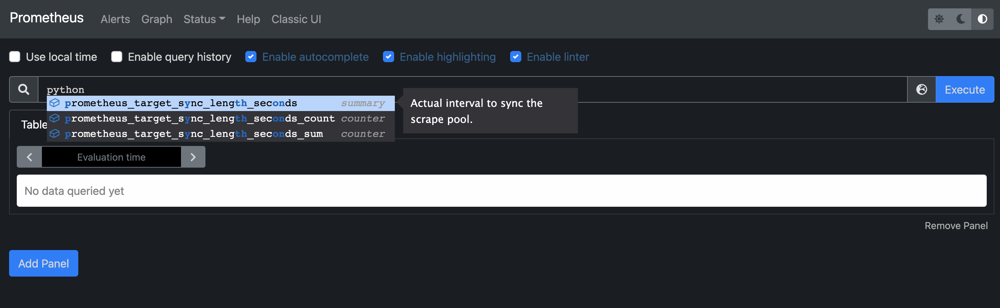
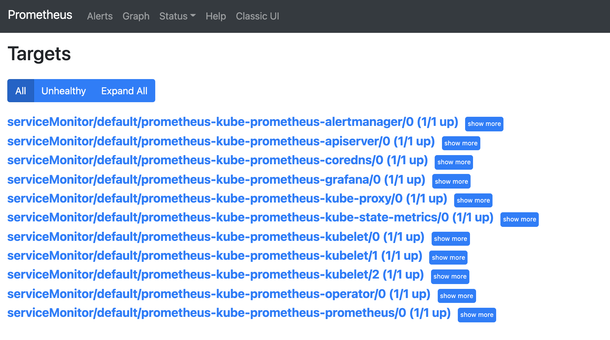
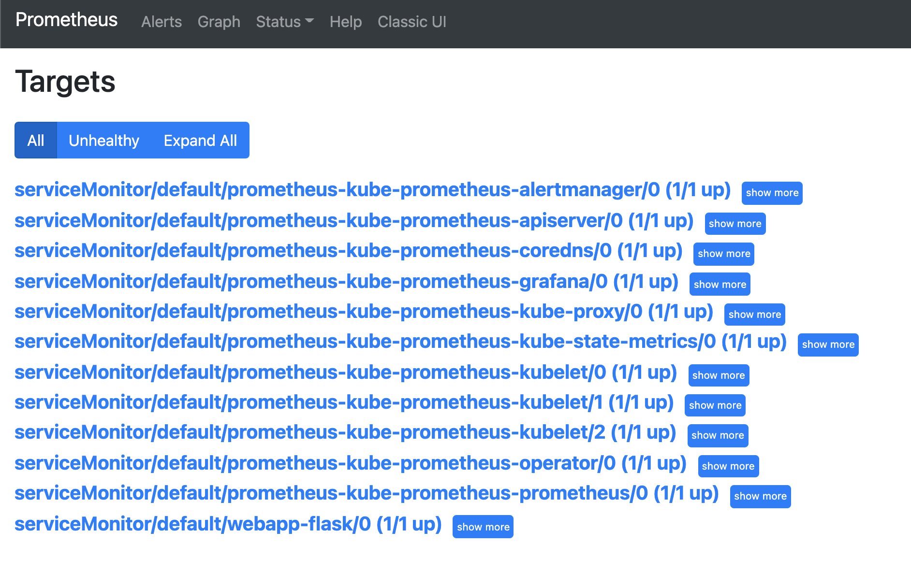
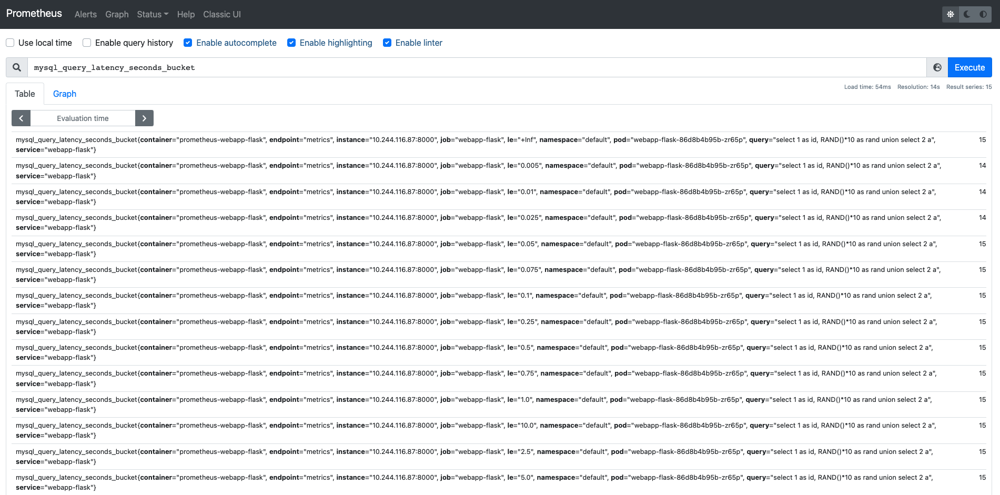

# Prometheus webapp Flask

* Deploy MySQL:
`$ kubectl apply -f kubernetes/mysql.yaml`

* Export docker-env to minikube:
`$ eval $(minikube -p prometheus docker-env)`

* Build image:
`$ docker build -t prometeheus-webapp-flask:latest .`

* Deploy webapp:
`$ kubectl apply -f kubernetes/webapp.yaml`

* Create port-forward to app:5000
`$ kubectl port-forward deployment/webapp-flask 5000`

```sh
# run curl
`$ curl localhost:5000`
Flask is up & running

`$ curl localhost:5000/query`
1,9.884217111285977
2,71.63233968581291
```

* Create port-forward to app:8000
`$ kubectl port-forward deployment/webapp-flask 8000`
```sh
`$ curl localhost:8000`

# HELP python_gc_objects_collected_total Objects collected during gc
# TYPE python_gc_objects_collected_total counter
python_gc_objects_collected_total{generation="0"} 69.0
python_gc_objects_collected_total{generation="1"} 43.0
python_gc_objects_collected_total{generation="2"} 0.0
# HELP python_gc_objects_uncollectable_total Uncollectable object found during GC
# TYPE python_gc_objects_uncollectable_total counter
python_gc_objects_uncollectable_total{generation="0"} 0.0
python_gc_objects_uncollectable_total{generation="1"} 0.0
python_gc_objects_uncollectable_total{generation="2"} 0.0
# HELP python_gc_collections_total Number of times this generation was collected
# TYPE python_gc_collections_total counter
python_gc_collections_total{generation="0"} 75.0
python_gc_collections_total{generation="1"} 6.0
python_gc_collections_total{generation="2"} 0.0
# HELP python_info Python platform information
# TYPE python_info gauge
python_info{implementation="CPython",major="3",minor="10",patchlevel="1",version="3.10.1"} 1.0
# HELP process_virtual_memory_bytes Virtual memory size in bytes.
# TYPE process_virtual_memory_bytes gauge
process_virtual_memory_bytes 3.2989184e+07
# HELP process_resident_memory_bytes Resident memory size in bytes.
# TYPE process_resident_memory_bytes gauge
process_resident_memory_bytes 1.9759104e+07
# HELP process_start_time_seconds Start time of the process since unix epoch in seconds.
# TYPE process_start_time_seconds gauge
process_start_time_seconds 1.63913698713e+09
# HELP process_cpu_seconds_total Total user and system CPU time spent in seconds.
# TYPE process_cpu_seconds_total counter
process_cpu_seconds_total 0.53
# HELP process_open_fds Number of open file descriptors.
# TYPE process_open_fds gauge
process_open_fds 8.0
# HELP process_max_fds Maximum number of open file descriptors.
# TYPE process_max_fds gauge
process_max_fds 1.048576e+06
# HELP flask_request_latency_seconds Flask Request Latency
# TYPE flask_request_latency_seconds histogram
flask_request_latency_seconds_bucket{endpoint="/query",le="0.005",method="GET"} 0.0
flask_request_latency_seconds_bucket{endpoint="/query",le="0.01",method="GET"} 0.0
flask_request_latency_seconds_bucket{endpoint="/query",le="0.025",method="GET"} 1.0
flask_request_latency_seconds_bucket{endpoint="/query",le="0.05",method="GET"} 1.0
flask_request_latency_seconds_bucket{endpoint="/query",le="0.075",method="GET"} 1.0
flask_request_latency_seconds_bucket{endpoint="/query",le="0.1",method="GET"} 1.0
flask_request_latency_seconds_bucket{endpoint="/query",le="0.25",method="GET"} 1.0
flask_request_latency_seconds_bucket{endpoint="/query",le="0.5",method="GET"} 1.0
flask_request_latency_seconds_bucket{endpoint="/query",le="0.75",method="GET"} 1.0
flask_request_latency_seconds_bucket{endpoint="/query",le="1.0",method="GET"} 1.0
flask_request_latency_seconds_bucket{endpoint="/query",le="2.5",method="GET"} 1.0
flask_request_latency_seconds_bucket{endpoint="/query",le="5.0",method="GET"} 1.0
flask_request_latency_seconds_bucket{endpoint="/query",le="7.5",method="GET"} 1.0
flask_request_latency_seconds_bucket{endpoint="/query",le="10.0",method="GET"} 1.0
flask_request_latency_seconds_bucket{endpoint="/query",le="+Inf",method="GET"} 1.0
flask_request_latency_seconds_count{endpoint="/query",method="GET"} 1.0
flask_request_latency_seconds_sum{endpoint="/query",method="GET"} 0.017151594161987305
flask_request_latency_seconds_bucket{endpoint="/",le="0.005",method="GET"} 2.0
flask_request_latency_seconds_bucket{endpoint="/",le="0.01",method="GET"} 2.0
flask_request_latency_seconds_bucket{endpoint="/",le="0.025",method="GET"} 2.0
flask_request_latency_seconds_bucket{endpoint="/",le="0.05",method="GET"} 2.0
flask_request_latency_seconds_bucket{endpoint="/",le="0.075",method="GET"} 2.0
flask_request_latency_seconds_bucket{endpoint="/",le="0.1",method="GET"} 2.0
flask_request_latency_seconds_bucket{endpoint="/",le="0.25",method="GET"} 2.0
flask_request_latency_seconds_bucket{endpoint="/",le="0.5",method="GET"} 2.0
flask_request_latency_seconds_bucket{endpoint="/",le="0.75",method="GET"} 2.0
flask_request_latency_seconds_bucket{endpoint="/",le="1.0",method="GET"} 2.0
flask_request_latency_seconds_bucket{endpoint="/",le="2.5",method="GET"} 2.0
flask_request_latency_seconds_bucket{endpoint="/",le="5.0",method="GET"} 2.0
flask_request_latency_seconds_bucket{endpoint="/",le="7.5",method="GET"} 2.0
flask_request_latency_seconds_bucket{endpoint="/",le="10.0",method="GET"} 2.0
flask_request_latency_seconds_bucket{endpoint="/",le="+Inf",method="GET"} 2.0
flask_request_latency_seconds_count{endpoint="/",method="GET"} 2.0
flask_request_latency_seconds_sum{endpoint="/",method="GET"} 0.0003592967987060547
flask_request_latency_seconds_bucket{endpoint="/sleep",le="0.005",method="GET"} 0.0
flask_request_latency_seconds_bucket{endpoint="/sleep",le="0.01",method="GET"} 0.0
flask_request_latency_seconds_bucket{endpoint="/sleep",le="0.025",method="GET"} 0.0
flask_request_latency_seconds_bucket{endpoint="/sleep",le="0.05",method="GET"} 0.0
flask_request_latency_seconds_bucket{endpoint="/sleep",le="0.075",method="GET"} 0.0
flask_request_latency_seconds_bucket{endpoint="/sleep",le="0.1",method="GET"} 0.0
flask_request_latency_seconds_bucket{endpoint="/sleep",le="0.25",method="GET"} 0.0
flask_request_latency_seconds_bucket{endpoint="/sleep",le="0.5",method="GET"} 0.0
flask_request_latency_seconds_bucket{endpoint="/sleep",le="0.75",method="GET"} 0.0
flask_request_latency_seconds_bucket{endpoint="/sleep",le="1.0",method="GET"} 0.0
flask_request_latency_seconds_bucket{endpoint="/sleep",le="2.5",method="GET"} 0.0
flask_request_latency_seconds_bucket{endpoint="/sleep",le="5.0",method="GET"} 0.0
flask_request_latency_seconds_bucket{endpoint="/sleep",le="7.5",method="GET"} 1.0
flask_request_latency_seconds_bucket{endpoint="/sleep",le="10.0",method="GET"} 1.0
flask_request_latency_seconds_bucket{endpoint="/sleep",le="+Inf",method="GET"} 1.0
flask_request_latency_seconds_count{endpoint="/sleep",method="GET"} 1.0
flask_request_latency_seconds_sum{endpoint="/sleep",method="GET"} 6.17152738571167
# HELP flask_request_latency_seconds_created Flask Request Latency
# TYPE flask_request_latency_seconds_created gauge
flask_request_latency_seconds_created{endpoint="/query",method="GET"} 1.6391374395264282e+09
flask_request_latency_seconds_created{endpoint="/",method="GET"} 1.639137469765403e+09
flask_request_latency_seconds_created{endpoint="/sleep",method="GET"} 1.6391374944026082e+09
# HELP flask_request_count_total Flask Request Count
# TYPE flask_request_count_total counter
flask_request_count_total{endpoint="/query",http_status="200",method="GET"} 1.0
flask_request_count_total{endpoint="/",http_status="200",method="GET"} 2.0
flask_request_count_total{endpoint="/sleep",http_status="200",method="GET"} 1.0
# HELP flask_request_count_created Flask Request Count
# TYPE flask_request_count_created gauge
flask_request_count_created{endpoint="/query",http_status="200",method="GET"} 1.6391374395264876e+09
flask_request_count_created{endpoint="/",http_status="200",method="GET"} 1.6391374697656999e+09
flask_request_count_created{endpoint="/sleep",http_status="200",method="GET"} 1.639137494402743e+09
# HELP mysql_query_latency_seconds MYSQL Query Latency
# TYPE mysql_query_latency_seconds histogram
mysql_query_latency_seconds_bucket{le="0.005",query="select 1 as id, RAND()*10 as rand union select 2 a"} 0.0
mysql_query_latency_seconds_bucket{le="0.01",query="select 1 as id, RAND()*10 as rand union select 2 a"} 0.0
mysql_query_latency_seconds_bucket{le="0.025",query="select 1 as id, RAND()*10 as rand union select 2 a"} 1.0
mysql_query_latency_seconds_bucket{le="0.05",query="select 1 as id, RAND()*10 as rand union select 2 a"} 1.0
mysql_query_latency_seconds_bucket{le="0.075",query="select 1 as id, RAND()*10 as rand union select 2 a"} 1.0
mysql_query_latency_seconds_bucket{le="0.1",query="select 1 as id, RAND()*10 as rand union select 2 a"} 1.0
mysql_query_latency_seconds_bucket{le="0.25",query="select 1 as id, RAND()*10 as rand union select 2 a"} 1.0
mysql_query_latency_seconds_bucket{le="0.5",query="select 1 as id, RAND()*10 as rand union select 2 a"} 1.0
mysql_query_latency_seconds_bucket{le="0.75",query="select 1 as id, RAND()*10 as rand union select 2 a"} 1.0
mysql_query_latency_seconds_bucket{le="1.0",query="select 1 as id, RAND()*10 as rand union select 2 a"} 1.0
mysql_query_latency_seconds_bucket{le="2.5",query="select 1 as id, RAND()*10 as rand union select 2 a"} 1.0
mysql_query_latency_seconds_bucket{le="5.0",query="select 1 as id, RAND()*10 as rand union select 2 a"} 1.0
mysql_query_latency_seconds_bucket{le="7.5",query="select 1 as id, RAND()*10 as rand union select 2 a"} 1.0
mysql_query_latency_seconds_bucket{le="10.0",query="select 1 as id, RAND()*10 as rand union select 2 a"} 1.0
mysql_query_latency_seconds_bucket{le="+Inf",query="select 1 as id, RAND()*10 as rand union select 2 a"} 1.0
mysql_query_latency_seconds_count{query="select 1 as id, RAND()*10 as rand union select 2 a"} 1.0
mysql_query_latency_seconds_sum{query="select 1 as id, RAND()*10 as rand union select 2 a"} 0.016342639923095703
mysql_query_latency_seconds_bucket{le="0.005",query="select SLEEP(RAND()*10) as sleeping"} 0.0
mysql_query_latency_seconds_bucket{le="0.01",query="select SLEEP(RAND()*10) as sleeping"} 0.0
mysql_query_latency_seconds_bucket{le="0.025",query="select SLEEP(RAND()*10) as sleeping"} 0.0
mysql_query_latency_seconds_bucket{le="0.05",query="select SLEEP(RAND()*10) as sleeping"} 0.0
mysql_query_latency_seconds_bucket{le="0.075",query="select SLEEP(RAND()*10) as sleeping"} 0.0
mysql_query_latency_seconds_bucket{le="0.1",query="select SLEEP(RAND()*10) as sleeping"} 0.0
mysql_query_latency_seconds_bucket{le="0.25",query="select SLEEP(RAND()*10) as sleeping"} 0.0
mysql_query_latency_seconds_bucket{le="0.5",query="select SLEEP(RAND()*10) as sleeping"} 0.0
mysql_query_latency_seconds_bucket{le="0.75",query="select SLEEP(RAND()*10) as sleeping"} 0.0
mysql_query_latency_seconds_bucket{le="1.0",query="select SLEEP(RAND()*10) as sleeping"} 0.0
mysql_query_latency_seconds_bucket{le="2.5",query="select SLEEP(RAND()*10) as sleeping"} 0.0
mysql_query_latency_seconds_bucket{le="5.0",query="select SLEEP(RAND()*10) as sleeping"} 0.0
mysql_query_latency_seconds_bucket{le="7.5",query="select SLEEP(RAND()*10) as sleeping"} 1.0
mysql_query_latency_seconds_bucket{le="10.0",query="select SLEEP(RAND()*10) as sleeping"} 1.0
mysql_query_latency_seconds_bucket{le="+Inf",query="select SLEEP(RAND()*10) as sleeping"} 1.0
mysql_query_latency_seconds_count{query="select SLEEP(RAND()*10) as sleeping"} 1.0
mysql_query_latency_seconds_sum{query="select SLEEP(RAND()*10) as sleeping"} 6.169459819793701
# HELP mysql_query_latency_seconds_created MYSQL Query Latency
# TYPE mysql_query_latency_seconds_created gauge
mysql_query_latency_seconds_created{query="select 1 as id, RAND()*10 as rand union select 2 a"} 1.6391374395256763e+09
mysql_query_latency_seconds_created{query="select SLEEP(RAND()*10) as sleeping"} 1.6391374944008963e+09
# HELP mysql_query_count_total Flask Request Count
# TYPE mysql_query_count_total counter
mysql_query_count_total{query="select 1 as id, RAND()*10 as rand union select 2 a"} 1.0
mysql_query_count_total{query="select SLEEP(RAND()*10) as sleeping"} 1.0
# HELP mysql_query_count_created Flask Request Count
# TYPE mysql_query_count_created gauge
mysql_query_count_created{query="select 1 as id, RAND()*10 as rand union select 2 a"} 1.6391374395261328e+09
mysql_query_count_created{query="select SLEEP(RAND()*10) as sleeping"} 1.6391374944018521e+09
```

* Check your metrics


* Check your targets:


* Export docker-env to minikube:
`$ kubectl apply -f kubernetes/service_monitor.yaml`

* Check your logs to config-reloader container into prometheus Pod:
```sh
$ kubectl logs prometheus-prometheus-kube-prometheus-prometheus-0 config-reloader -f

ts=2021-12-11T17:23:51.927271811Z caller=log.go:168 level=info msg="Reload triggered" cfg_in=/etc/prometheus/config/prometheus.yaml.gz cfg_out=/etc/prometheus/config_out/prometheus.env.yaml watched_dirs=/etc/prometheus/rules/prometheus-prometheus-kube-prometheus-prometheus-rulefiles-0
```

* Check again your targets


* Check again your metrics
